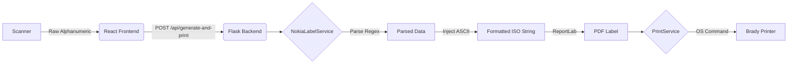

# System Patterns

## Architecture Overview
The system follows a client-server architecture:
- **Frontend:** React-based single-page application (SPA) focused on input capture and status reporting.
- **Backend:** Flask-based Python server handling data processing, PDF generation, and OS-level printing commands.

## Key Technical Decisions

### 1. Reused Architecture
The project leverages the **Flask Backend + React Frontend** architecture from the `pdf_print_brady` repository, capitalizing on existing printer discovery and execution logic.

### 2. Service-Oriented Backend
The backend is organized into specialized services:
- `NokiaLabelService`: Responsible for string parsing, ISO-15434 formatting, and PDF layout using ReportLab.
- `PrintService`: Handles printer discovery and executes native OS print commands (`powershell` on Windows, `lpr` on Unix).

### 3. "Dirtying" Process (ISO-15434 Injection)
The core logic for compliance involves injecting ASCII control characters into the parsed data:
- `{RS}` (chr 30): Record Separator
- `{GS}` (chr 29): Group Separator
- `{EOT}` (chr 4): End of Transmission

### 4. Aggressive Focus & Key Suppression
To handle barcode scanners that act as keyboards, the frontend implements:
- **Global Key Filter:** Intercepts and prevents default browser behavior for common scanner-triggered shortcuts (e.g., `Alt+Left`).
- **Auto-Refocus Loop:** Ensures the hidden/visible input field always has focus, checking every 2 seconds.
- **Debounced Auto-Submit:** Automatically triggers processing after a short pause (500ms) in scanner input.

## Data Flow

## Component Relationships
- `app.py`: Main Flask entry point and API route definitions.
- `services.py`: Contains `NokiaLabelService` and `PrintService` classes.
- `BarcodeInput.jsx` (Frontend): Critical component for capturing scans reliably.
